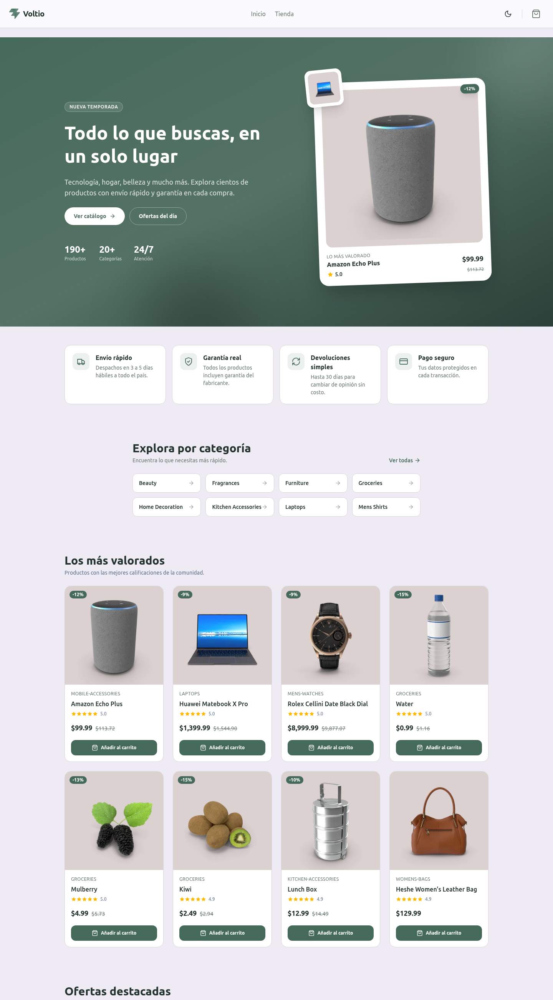
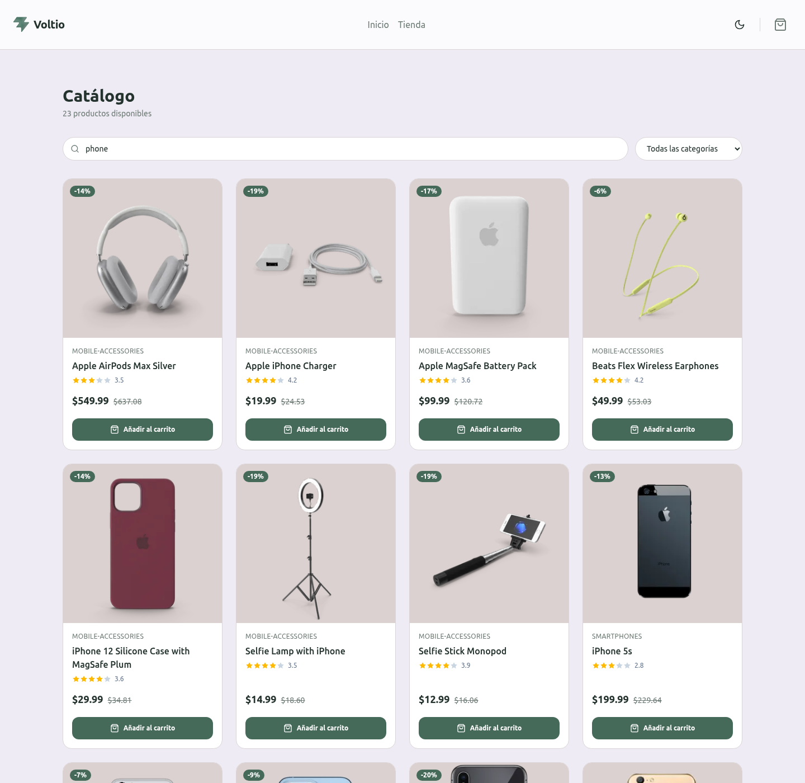
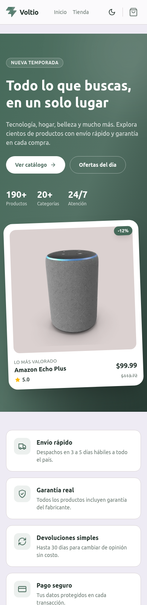

# Voltio — E-commerce en React

Aplicación de e-commerce construida con **React + TypeScript + Vite** que consume la API pública [DummyJSON](https://dummyjson.com/docs/products). Renderiza productos de forma dinámica y ofrece una experiencia de usuario clara, responsiva y estética, con soporte para modo claro/oscuro.

## Descripción

Voltio es una tienda online que permite explorar un catálogo de productos reales servidos por DummyJSON. Los usuarios pueden:

- Ver un listado de productos obtenidos desde la API.
- Buscar productos por nombre (con _debounce_ y sincronización en la URL).
- Filtrar por categoría y navegar el catálogo con paginación.
- Ver el detalle de cada producto (precio, descuento, stock, envío, garantía y reseñas).
- Añadir productos a un carrito persistente y completar un flujo de checkout.
- Visualizar estados de **carga** y **error** de forma clara.
- Alternar entre **modo claro y oscuro**.

La interfaz usa un design system basado en tokens de color (variables CSS) con una paleta _sage_ coherente en toda la aplicación.

## Componentes creados

Componentes mínimos obligatorios de la consigna:

| Componente | Descripción | Ubicación |
|------------|-------------|-----------|
| `Header` | Logo + nombre de la tienda y navegación | `src/components/layout/Header.tsx` · `src/templates/Headers/DefaultHeaderTemplates.tsx` |
| `SearchBar` | Input controlado para búsqueda | `src/components/products/SearchBar.tsx` |
| `ProductCard` | Muestra un producto usando props | `src/components/products/ProductCard.tsx` |
| `ProductList` | Renderiza la lista de productos | `src/components/products/ProductList.tsx` |
| `Loader` | Indicador visual de carga | `src/components/ui/Loader.tsx` |
| `ErrorMessage` | Muestra errores al fallar la API | `src/components/ui/ErrorMessage.tsx` |
| `Footer` | Información básica de la tienda | `src/components/layout/Footer.tsx` |

Componentes y módulos adicionales:

- **UI reutilizable:** `Button`, `Card`, `Badge`, `Input`, `Rating`, `Icons`, `ThemeToggle` (`src/components/ui/`).
- **Carrito:** `CartDrawer` (`src/components/cart/`) + `CartContext` (`src/context/CartContext.tsx`).
- **Tema:** `ThemeContext` (`src/context/ThemeContext.tsx`) para modo claro/oscuro.
- **Páginas:** Inicio, Tienda, Detalle de producto, Checkout y 404 (`src/pages/`).
- **Hooks:** `useProducts`, `useProduct`, `useCategories`, `useDebouncedValue` (`src/hooks/`).
- **Servicios:** `products.service.ts` (`src/services/`) para el consumo de la API.

## Consumo de API

- URL base: `https://dummyjson.com` (configurable vía `VITE_API_URL` en `.env`).
- El listado se obtiene con `fetch` dentro de un `useEffect` (hook `useProducts`), usando `AbortController` para cancelar peticiones obsoletas.
- Se manejan los tres estados requeridos:
  - **`loading`** → se muestra el `Loader`.
  - **`error`** → se muestra el `ErrorMessage`.
  - **`products`** → se renderiza el `ProductList`.

Endpoints usados: `/products`, `/products/search`, `/products/category/:slug`, `/products/:id`, `/products/categories`.

## Tecnologías usadas

- [React 19](https://react.dev/) + [TypeScript](https://www.typescriptlang.org/)
- [Vite](https://vite.dev/) como bundler y servidor de desarrollo
- [React Router](https://reactrouter.com/) para el enrutamiento
- [Tailwind CSS 4](https://tailwindcss.com/) para los estilos
- [DummyJSON](https://dummyjson.com/) como API de productos
- ESLint para el linting

## Cómo ejecutar el proyecto

Requisitos: **Node.js 18+** y un gestor de paquetes (`pnpm`, `npm` o `yarn`).

```bash
# 1. Clonar el repositorio
git clone <url-del-repositorio>
cd dummyjson-ecommerce

# 2. Instalar dependencias
pnpm install        # o: npm install

# 3. Configurar variables de entorno
#    Crear un archivo .env en la raíz con:
echo "VITE_API_URL=https://dummyjson.com/" > .env

# 4. Levantar el servidor de desarrollo
pnpm dev            # o: npm run dev
```

La aplicación quedará disponible en `http://localhost:5173`.

Scripts disponibles:

| Script | Descripción |
|--------|-------------|
| `pnpm dev` | Servidor de desarrollo con HMR |
| `pnpm build` | Compila TypeScript y genera el build de producción |
| `pnpm preview` | Sirve el build de producción localmente |
| `pnpm lint` | Ejecuta ESLint |

## Capturas de pantalla

### Vista general (Inicio)



### Catálogo


### Búsqueda funcionando



### Detalle de producto


### Vista mobile (responsivo)



---

Proyecto educativo sin fines comerciales — Diplomado Full Stack, Módulo 2.
